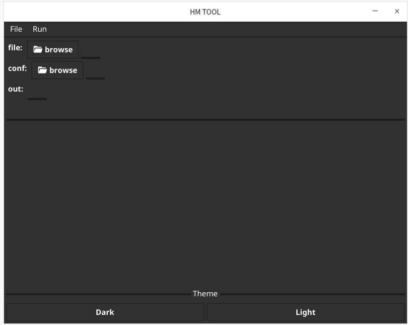
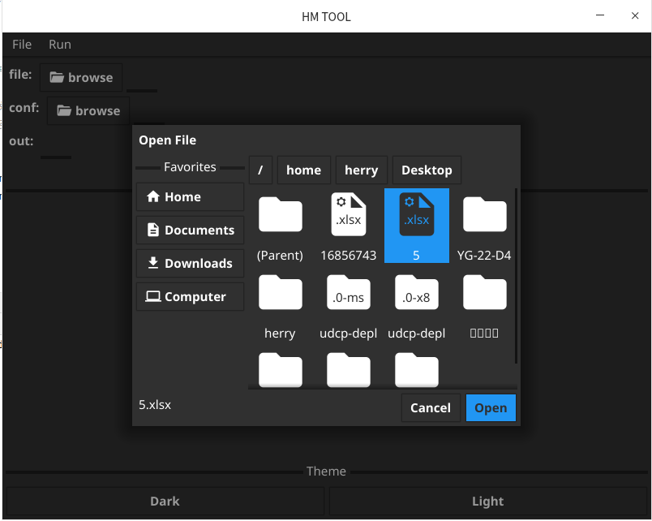
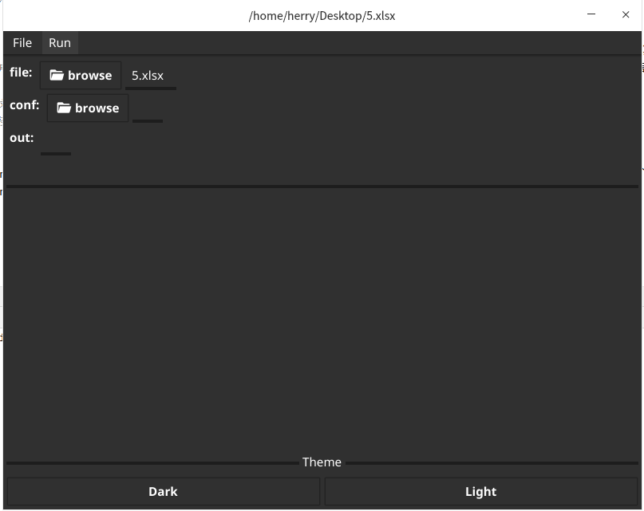
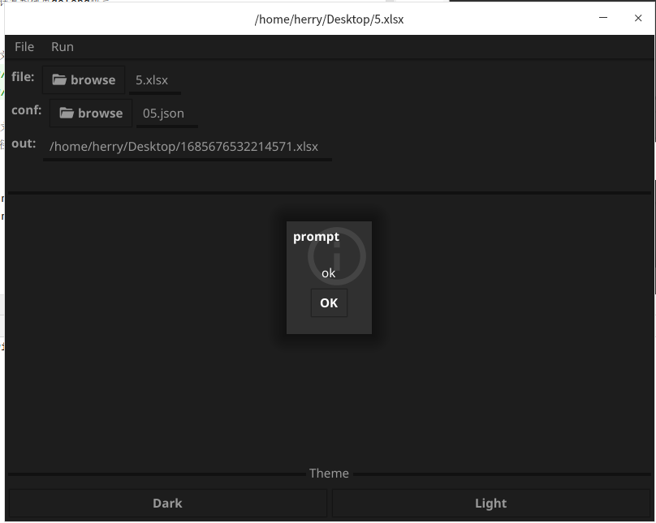

# fyne-attendance 
* 使用fyne实现的一个根据考勤excel文件，计算加班时长的gui工具
* 客户端界面和服务端计算均使用golang语言

## 功能说明
- 选择考勤文件和配置文件（每个月的假期标注，是一个int数组）
  
  
  
- 点击运行,后台计算生成excel文件,并显示生成的文件路径
  

## 打包
- Linux:   fyne-cross linux
- Windows: fyne-cross windows -arch=amd64 -app-id=v1.0.0

## 字体
- 字体文件下载地址 https://www.fonts.net.cn/
- fyne bundle fonts.ttf >> bundle.go

## 主题切换
- vendor/fyne.io/fyne/v2/settings.go
- /vendor/fyne.io/fyne/v2/app/settings.go
```
+func (s *settings) UpdateTheme() {
+	name := s.schema.ThemeName
+	if env := os.Getenv("FYNE_THEME"); env != "" {
+		name = env
+	}
+
+	variant := defaultVariant()
+	effectiveTheme := s.theme
+	if !s.themeSpecified {
+		effectiveTheme = s.loadSystemTheme()
+	}
+	switch name {
+	case "light":
+		variant = theme.VariantLight
+	case "dark":
+		variant = theme.VariantDark
+	}
+
+	s.applyTheme(effectiveTheme, variant)
+}
```
